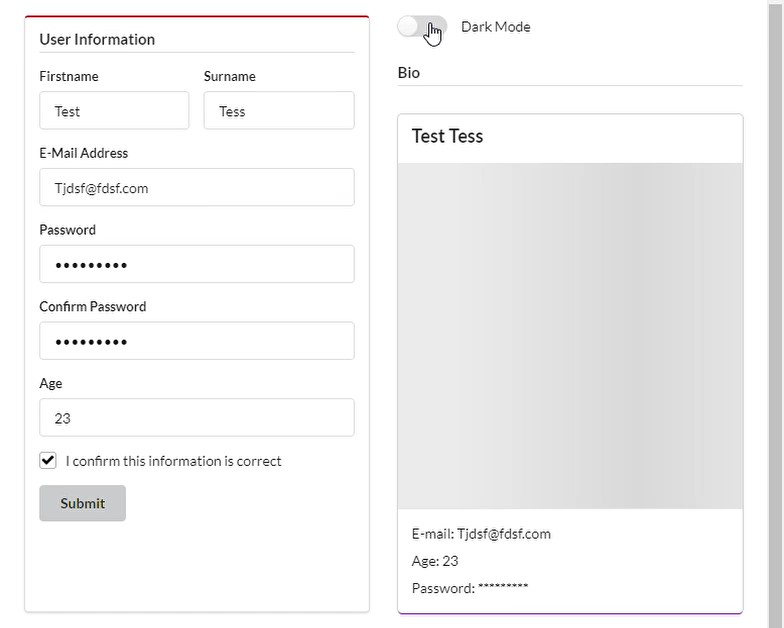
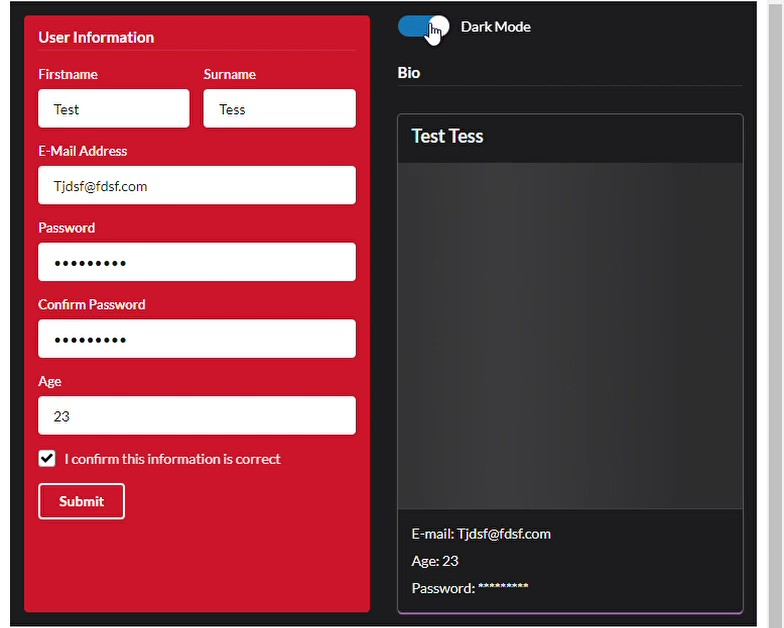

## `fomantic.plus`

<!-- badges: start -->
[](https://github.com/ashbaldry/fomantic.plus/actions)
[](https://app.codecov.io/gh/ashbaldry/fomantic.plus)
<!-- badges: end -->

`{fomantic.plus}` contains a series of functions that create elements and perform behaviours from [Fomantic UI](https://fomantic-ui.com/); the package works as an extension to the [`{shiny.semantic}`](https://github.com/Appsilon/shiny.semantic/) package.

### Form Validation

Input validation is an important part of shiny applications, and with `form_validation` you can have (the majority) of the validation done within the UI.


### Navbar Page

Similar to `{shiny}`'s navbarPage, `{fomantic.plus}` includes the ability to create a page with a navbar, along with the options to show/hide tabs, and change to a specific tab on the server-side.

Bootstrap UI (`shiny`)             |  Fomantic UI (`fomantic.plus`)
:-------------------------:|:-------------------------:
  |  

### Dark Mode

Using `darkmode_toggle()` will include a toggle in the UI to enable all Fomantic UI elements to change into the "inverted" class, giving the ability to have a light and dark mode application

Light Mode            |  Dark Mode
:-------------------------:|:-------------------------:
  |  

## Installation

```r
devtools::install_github("ashbaldry/fomantic.plus")
```

## Examples

- [Form Validation](https://github.com/ashbaldry/fomantic.plus/tree/main/inst/examples/form_validation)
- [Navbar Page](https://github.com/ashbaldry/fomantic.plus/tree/main/inst/examples/navbar_page)
